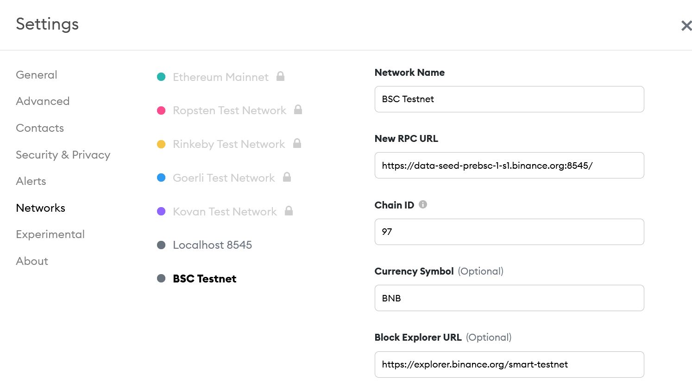
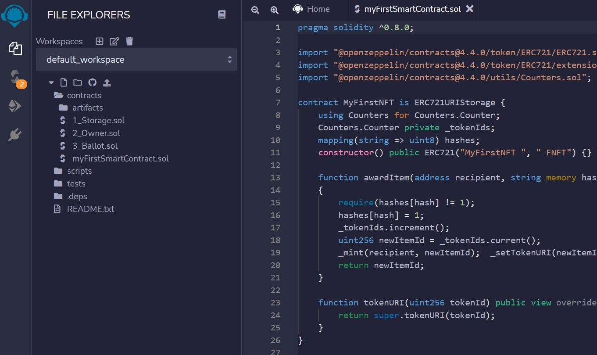
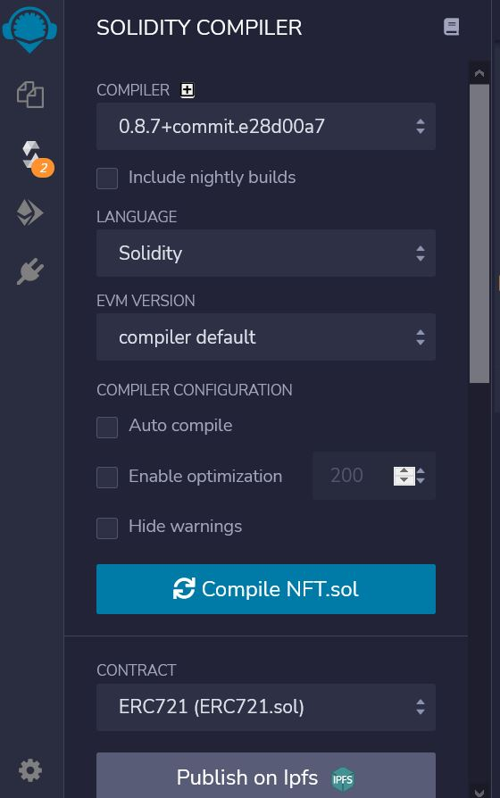
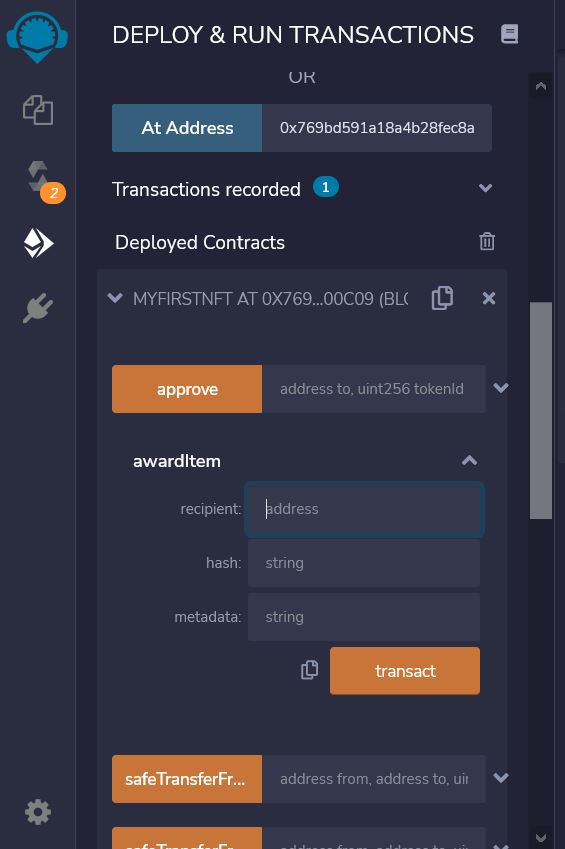
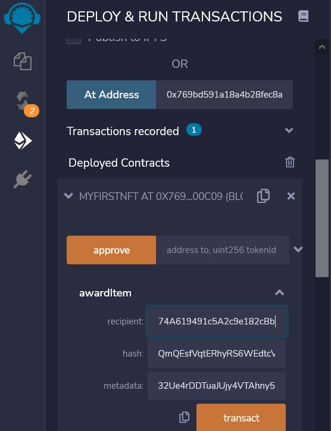
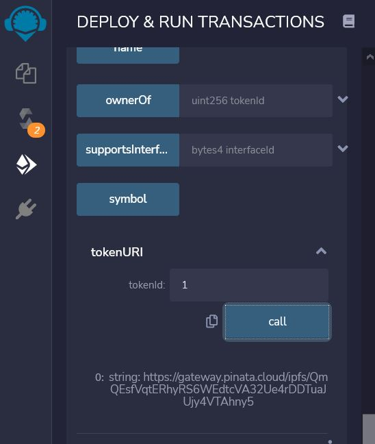
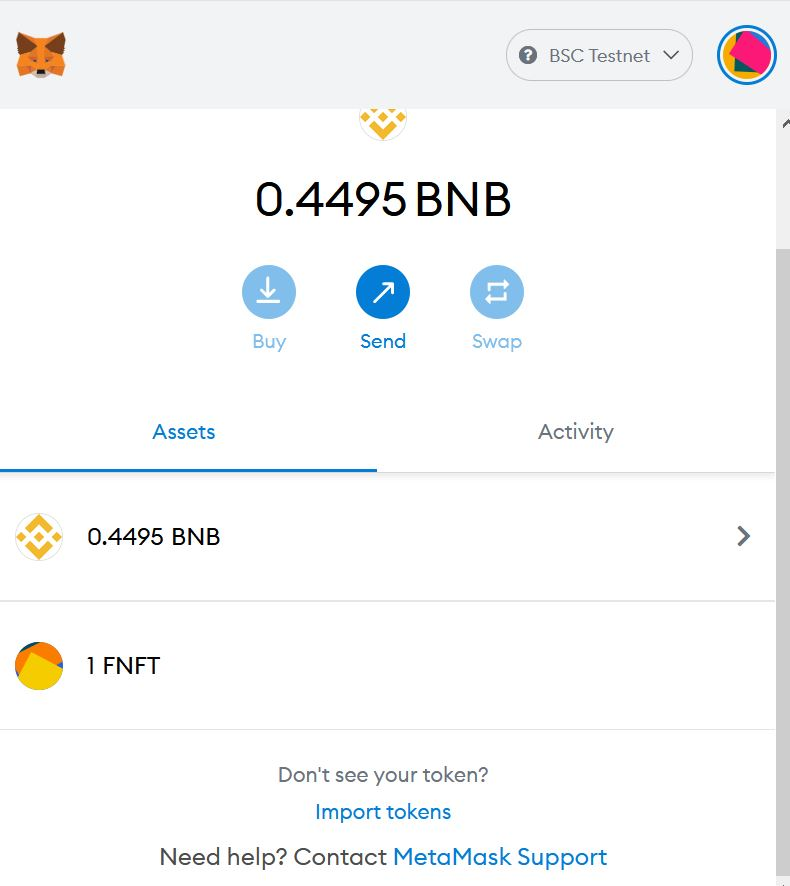
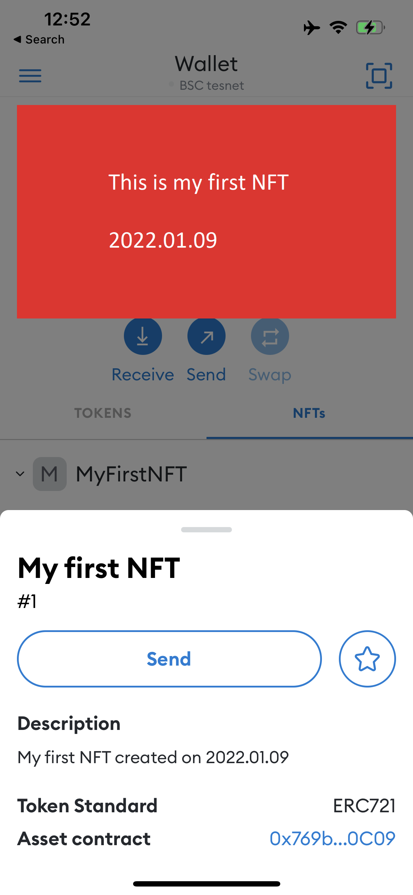

# **How to mint your first NFT**

---

## High level workflow

1. [Prepare a new crypto wallet using Test Network](#1-prepare-a-new-crypto-wallet)
2. [Getting some coins in Test Network for gas fee](#2-getting-some-coins-in-test-network-for-gas-fee)
3. [Create a new smart contract](#3-create-a-new-smart-contract)
4. [Upload your design and metadata to IPFS provider](#4-upload-your-design-and-metadata-to-ipfs-provider)
5. [Invoke the smart contract created above](#5-invoke-the-smart-contract-created-above)
6. [Validate your NFT](#6-validate-your-nft)

## Technologies used in this example

- MetMask - Crypto Wallet
- Remix - Ethereum IDE
- Pinta - IPFS provider
- OpenZepellin - Library for smart contract

## Support chain

- Ethereum
- Binance smart chain

## 1. Prepare a new crypto wallet

Install [MetaMask ](https://metamask.io/)in your computer/web browser. Make sure that you keep you secret backup phrase in a safe place. Switch your wallet network to the BSC Testnet which need to be added manually.

| Field              | Value                                                                                              |
| ------------------ | -------------------------------------------------------------------------------------------------- |
| Network Name       | BSC Testnet                                                                                        |
| New RPC URL        | [https://data-seed-prebsc-1-s1.binance.org:8545/](https://data-seed-prebsc-1-s1.binance.org:8545/) |
| Chain ID           | 97                                                                                                 |
| Currency Symobl    | BNB                                                                                                |
| Block Explorer URL | [https://explorer.binance.org/smart-testnet](https://explorer.binance.org/smart-testnet)           |



## 2. Getting some coins in Test Network for gas fee

Currently you have 0 ETH in your wallet and you need some fund to deploy the smart contract and mint the NFT.

- For ETH, Go to [https://app.mycrypto.com/faucet](https://app.mycrypto.com/faucet) and connect to your wallet.
- For BNB, Go to [https://testnet.binance.org/faucet-smart](https://testnet.binance.org/faucet-smart) and put your address.

## 3. Create a new smart contract

To write and deploy a new NFT smart contract, we use REMIX, a Ethereum online IDE, to interact with the Blockchain.

### Develop smart contract

1. Use your web browser and navigate to [ https://remix.ethereum.org](https://remix.ethereum.org/)
2. You willl find some folders and files has been created for you.
3. Create a new file under /contracts folder called "myFirstSmartContract.sol"
4. Copy below code to the new file

```sol
pragma solidity ^0.8.0;

import "@openzeppelin/contracts@4.4.0/token/ERC721/ERC721.sol";
import "@openzeppelin/contracts@4.4.0/token/ERC721/extensions/ERC721URIStorage.sol";
import "@openzeppelin/contracts@4.4.0/utils/Counters.sol";

contract MyFirstNFT is ERC721URIStorage {
    using Counters for Counters.Counter;
    Counters.Counter private _tokenIds;
    mapping(string => uint8) hashes;
    constructor() public ERC721("MyFirstNFT ", " FNFT") {}

    function awardItem(address recipient, string memory hash, string memory metadata) public returns (uint256)
    {
        require(hashes[hash] != 1);
        hashes[hash] = 1;
        _tokenIds.increment();
        uint256 newItemId = _tokenIds.current();
        _mint(recipient, newItemId);  _setTokenURI(newItemId, metadata);
        return newItemId;
    }

    function tokenURI(uint256 tokenId) public view override(ERC721URIStorage) returns (string memory) {
        return super.tokenURI(tokenId);
    }
}
```



### Compiler smart contract

1. Click "Solidity Compiler" in left hand side menu bar
2. Select "0.8.7+commit.e28d00a7" in "COMPILER" field
3. Ignore the warning and continue



### Deploy smart contract

1. Click "Deploy and Run Transaction" in left hand side menu bar
2. Select "Injected Web3" in "ENVIRONMENT" field
3. Select your wallet address
4. Click on Deploy button
5. MetaMask will be prompted and ask for paying the gas fee
6. You smart contract will be shown on bottom left "Deployed Contract"
7. Copy the contract address by click on copy icon (sample: 0x769bD591A18A4B28FEc8Ab70f11395e25B900C09)



## 4. Upload your design and metadata to IPFS provider

After created a new smart contract and deployed in the Test Network, you need to upload your design and metadata json to IPFS provider and retrieve the CID. Navigate to [https://www.pinata.cloud/](https://www.pinata.cloud/)

- Create a new account in Pinata
- Upload your design
- Copy the CID of your design
- Prepare the json file and modify the CID value to your own CID

```json
{
  "description": "This is my first NFT even created",
  "external_url": "https://www.google.com",
  "image": "https://gateway.pinata.cloud/ipfs/<REPLACE_WITH_YOUR_CID_VALUE>",
  "name": "My first NFT",
  "attributes": []
}
```

- Retrieve the CID of the metadata.json for invoking the smart contract

## 5. Invoke the smart contract created above

It's time to mint your NFT now. Go back to Remix and expand the **awardItem** function, this function takes three parameters:

| Field     | Value                                             | Sample value                                                                                                                                                         |
| --------- | ------------------------------------------------- | -------------------------------------------------------------------------------------------------------------------------------------------------------------------- |
| receipent |                                                   | 0x616b1C5C2B34b0e3ca74A619491c5A2c9e182cBb                                                                                                                           |
| hash      | the CID of your JSON file that produced by Pinata | QmQEsfVqtERhyRS6WEdtcVA32Ue4rDDTuaJUjy4VTAhny5                                                                                                                       |
| metadata  | Pinata URL + the CID of your JSON file            | [https://gateway.pinata.cloud/ipfs/QmQEsfVqtERhyRS6WEdtcVA32Ue4rDDTuaJUjy4VTAhny5](https://gateway.pinata.cloud/ipfs/QmQEsfVqtERhyRS6WEdtcVA32Ue4rDDTuaJUjy4VTAhny5) |



##  6. Validate your NFT

To validate your NFT has been mint correctly, we can verify via two approaches:

- Use the **tokenURI** function that we defined in the smart contract and see if it return the metadata URL.



- View in tool/market

#### **To view in tool/market depends on your chain selection**

For ETH test network, you can view in opensea directly.

- User your web brower and navigate to[ https://testnets.opensea.io/](https://testnets.opensea.io/)
- Connect Opensea with Metamask (make sure you use the correct test network)
- Go to your account and open the **Activity** tab.
- You will see the NFT that you have just minted with all the metadata associated.

For BSC test network, you need to view in MOBILE version MetaMask. The deskop version does **NOT** support viewing NFT yet. (As of Jan 2022)

- Open your MetaMask in your mobile
- Click on "Import tokens"



- Input below information<br>

| Field                  | Value                                                                   |
| ---------------------- | ----------------------------------------------------------------------- |
| Token Contract Address | your contract address - copy from Remix deploy and run transaction part |
| Token Symbol           | Leave as EMPTY                                                          |
| Token Decimal          | 1                                                                       |



# **Congratulations! You mint your first NFT!**

### References:

[Building your first NFT using Remix](https://www.inmindsoftware.com/2021/06/30/building-your-first-nft-an-easy-tutorial-part-1/)
